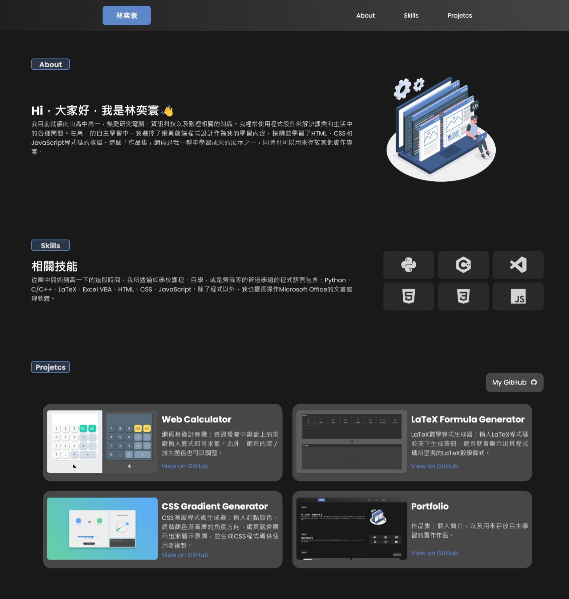

# 作品集 Portfolio

這是一個響應式作品集網頁。我使用了HTML和CSS來創建及設計網頁。其中，這個頁面包含：導覽列、主要部分、技能部分、專案部分。此外，這個作品集網頁也套用了響應式設計，以符合不同大小的瀏覽裝置。\
This is a responsive portfolio webpage. I used HTML and CSS to create and design the page. The webpage includes: a navigation bar, main section, skills section, and project section. Additionally, this portfolio webpage is designed to be responsive to fit different device sizes.

## 截圖 Screenshot
